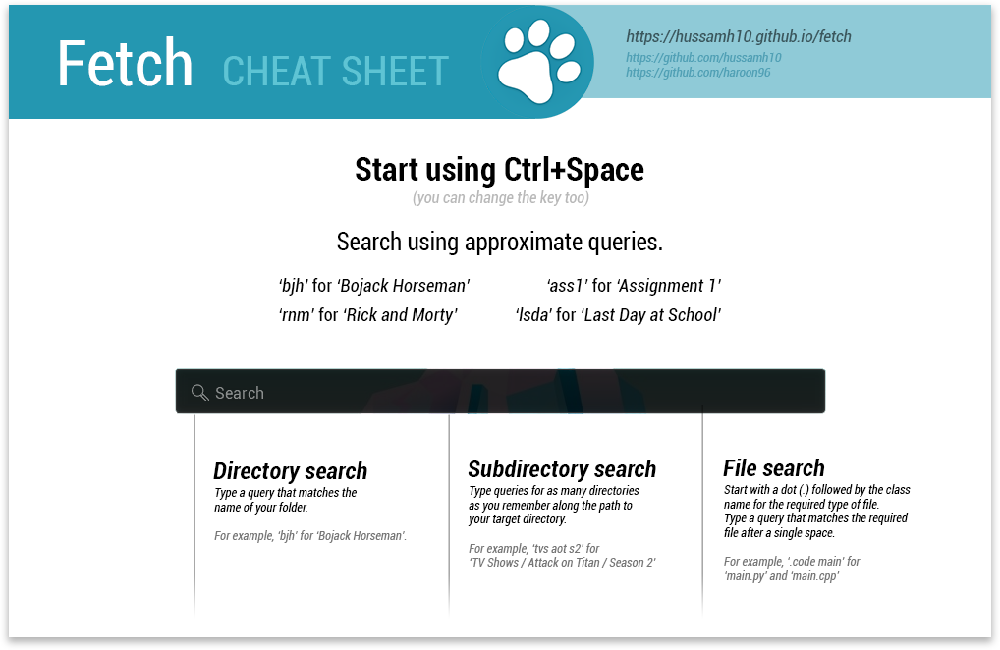

	

<h1 align="center">
	Fetch A fuzzy folder finder.
</h1>

## Description
Fetch allows you to find and open folders on your computer by indexing your directories and using approximate query matching, Fetch allows you convenient access to your data at much faster speeds. You can also search within subdirectories.

## Features
- Search folders
- Approximate query matching
- OS wide indexing
- Periodic indexing
- Ranked results
- Subdirectory search

## Installation:
- Download and install the [latest release](https://github.com/hussamh10/fetch/releases/latest) for your OS.
- Start using **Ctrl+Space** for the first launch.
- Wait for Fetch to finish indexing.

## Usage:
- Follow this cheatsheet and you'll know how to use Fetch within seconds.

	

## Configuration
To edit the configurations for Fetch, open Settings from the tray icon. Below are some configurable settings.

- Fetch ships with two themes — light and dark — by default but custom themes can also be applied using CSS. Create a folder named `themes` inside the application configuration folder (Linux: `~/.fetch`, Windows: `%LOCALAPPDATA%/Fetch`). Place the file containing your custom CSS styles inside this folder. For reference, see the [CSS for the dark theme](https://github.com/hussamh10/fetch/blob/master/src/assets/themes/default-dark.css).
- Toggle whether to start Fetch on system boot.
- Set the launch key for Fetch. (Default: Ctrl+Space)
- Timeout to wait before re-indexing the system. (Default: one hour)
- Which directories to include in the index.
- 	Regex-based exclusions list.

## Project team:
- [Muhammad Haroon](https://github.com/haroon96)
- [Hussam Habib](https://github.com/hussamh10)

## Donate:
  **BTC** :1E4yS81wSgFMZ2TVrGLLK2fwpQryr9wqZ3
  

