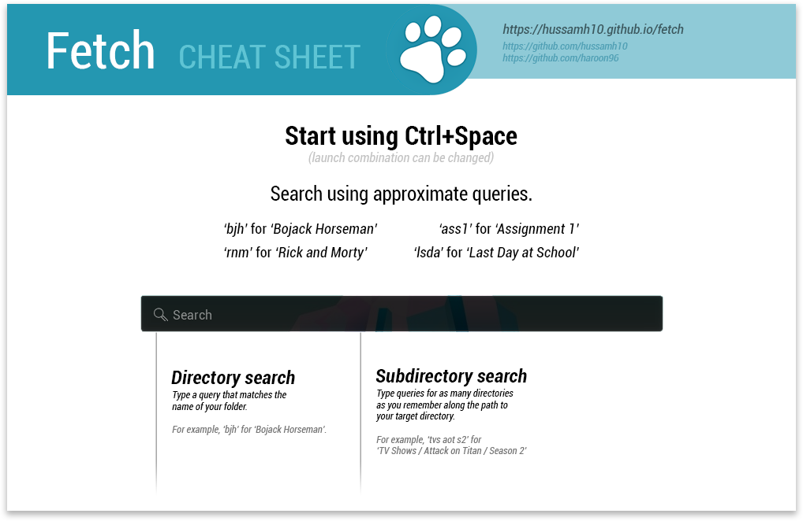

	

<h1 align="center">
	Fetch A fuzzy file and folder finder.
</h1>

## Description
Fetch allows you to find and open any file or folder on your computer. By indexing your directories and using approximate query matching, Fetch allows you to access your files at a much higher speed than the built-in Windows search. You can also search within subdirectories and for files based on their type.

## Features
- Search files and folders
- Approximate query matching
- OS wide indexing
- Periodic indexing
- Ranked results
- Search using file types
- Subdirectory search

## Usage:
- Follow this cheatsheet and you'll know how to use Fetch within seconds.

	

## Supported classes:

Class name  | Supported file types
------------| -------------
.code  | .py .java .cpp .html .cs .css .rb .mat .hdf5 .rb .go .c .asm .h .vb
.pic   | .bmp .png .jpg .jpeg .gif .tiff .psd .svg .ico
.doc   | .pdf .ppt .pptx .docx .odt .txt .xlsx .htm .csv .xml .odp .rtf .doc .tex
.arch  | .rar .gz .zip .7z .pkg .deb .z
.audio | .pcm .wav .aiff .mp3 .aac .ogg .wma .flac .alac .midi
.video | .mp4 .avi .mkv .flv .mpg .wmv .vob .m4v .3gp 

## Installation:
- Install [Python](https://python.org) on your computer.
- [Download](https://github.com/hussamh10/fetch/releases/download/stable/Fetch-Setup.exe) and install the stable release for Windows.
- Run `Fetch.exe`.
- Wait for Fetch to prompt you when indexing is complete.

## Project team:
- [Muhammad Haroon](https://github.com/haroon96)
- [Hussam Habib](https://github.com/hussamh10)

## Donate:
  **BTC** :1E4yS81wSgFMZ2TVrGLLK2fwpQryr9wqZ3

